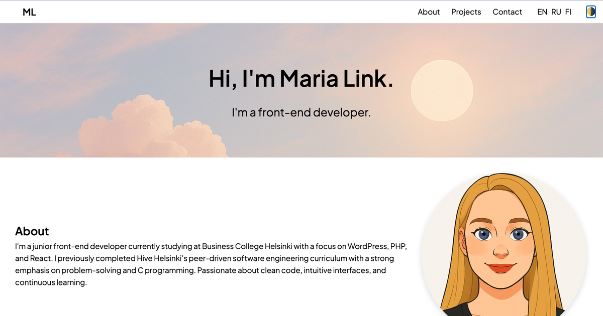

# Maria Link — Web Portfolio

**Live:** https://mashalink.github.io/web-portfolio/  
**Repo:** https://github.com/mashalink/web-portfolio

A personal one-page portfolio with a separate projects page. Built using pure **HTML/CSS/JavaScript**, fully responsive, multilingual (EN/RU/FI), light/dark themes, smooth transitions, burger menu, modals, “back to top” button, and accessibility features.

## 

## ✨ Features

- **Hero** section with background image (day/night per theme)
- **About** section with text and avatar, fully responsive
- **Projects** grid with “More Projects” button
- **Separate `projects.html` page** with a **9-card CSS Grid** gallery and **modal windows**
- **Mobile menu** (burger) + smooth scrolling
- **Light/Dark theme** (saved in `localStorage`, favicon changes)
- **Footer contact form** with validation (`mailto:` sending)
- **Back-to-top button** appearing before footer
- **Accessibility**: ARIA attributes, focus styles, `.sr-only`
- **i18n**: EN / RU / FI (translates text, placeholders, project cards, buttons)

---

## 🗂 Folder Structure

```
web-portfolio/
├─ css/
│  ├─ burger.css
│  ├─ cards.css
│  ├─ contacts.css
│  ├─ hero.css
│  ├─ modal.css
│  ├─ projects.css
│  ├─ style.css
│  └─ to-top.css
├─ img/
│  ├─ icons/
│  │  ├─ favicon-theme-night.ico
│  │  └─ favicon-theme-sunset.ico
│  ├─ screenshots/
│  │  └─ ... (project screenshots)
│  ├─ hero-bg-day.png
│  ├─ hero-bg-night.png
│  ├─ photo.png
│  └─ preview.png
├─ js/
│  ├─ burger.js
│  ├─ card.js
│  ├─ contacts.js
│  ├─ i18n.js
│  ├─ main.js
│  ├─ projects.js
│  ├─ theme.js
│  └─ to-top.js
├─ projects/
│  └─ ... (individual project files)
├─ .gitignore
├─ LICENSE
├─ index.html
├─ projects.html
└─ README.md
```

---

## 🚀 Run Locally

No build tools needed — it’s a static website.

1. Clone the repository:
   ```bash
   git clone https://github.com/mashalink/web-portfolio.git
   cd web-portfolio
   ```
2. Open `index.html` in your browser **or** use **VS Code Live Server** (recommended for module scripts).

---

## 🌐 Deploy to GitHub Pages

1. Go to **Settings** → **Pages** in your repository.
2. Set **Source**: `Deploy from a branch` → `main` → `/ (root)`.
3. Save — your site will be live at `https://<username>.github.io/web-portfolio/`.

---

## 🧩 Internationalization (i18n)

- Base text and placeholders are in `js/i18n.js` (`translations` object).
- Home page project cards translations — `js/card.js` (`projectsShortData` object).
- “Projects” title and “More Projects” button — also in `js/card.js`.
- `projects.html` translations (gallery & modals) — `js/projects.js`.

Language is stored in `localStorage` as `"lang"`.  
Changing language updates the DOM instantly via a custom event `lang:change`.

---

## 🎨 Themes

- Light/Dark theme stored in `localStorage` as `"theme"`.
- Applied as a class on `<body>`.
- Favicon changes dynamically in `js/theme.js`.
- Toggle button: `<button class="theme-toggle">`.

---

## 🧪 Contact Form Validation

- Validates `Name`, `Email`, and `Message` (`js/contacts.js`).
- Displays inline error messages.
- Sends via `mailto:` to `maria8link@gmail.com`.
- ARIA-friendly: `aria-invalid`, `aria-describedby`, and `.status` live region.

---

## ♿ Accessibility

- Visible focus styles (`:focus-visible`) in theme colors.
- `.sr-only` class for hidden screen reader texts (e.g., “opens in a new tab”).
- Semantic HTML, `aria-label` / `aria-labelledby`, `role="list"` / `"listitem"`.

---

## ✅ Checklist

- [x] Hero with background
- [x] About section (text + photo)
- [x] Fully responsive layout
- [x] Mobile menu (burger)
- [x] Separate projects page (9-card grid)
- [x] Smooth scrolling
- [x] Modal windows (projects.html)
- [x] Back-to-top button
- [x] Light/Dark theme
- [x] Footer contact form (working, validated)
- [x] Smooth animations
- [x] Projects section with cards and “More Projects” button
- [x] i18n (EN/RU/FI)
- [x] SEO/Meta/OG/Twitter tags + favicon

---

## 📸 Social Preview

- Social sharing image: `img/preview.png`
- Open Graph and Twitter meta tags are already in `<head>`.

---

## 🐞 Debugging Tips

- If layout overflows on mobile — check `padding-inline`, `width:100%`, `max-width`, and `overflow-x`.
- When testing modules locally, use Live Server to avoid CORS issues.

---

## 📄 License

This project is licensed under the **MIT License** — see `LICENSE` for details.
