# Maria Link — Web Portfolio

**Live:** https://mashalink.github.io/web-portfolio/  
**Repo:** https://github.com/mashalink/web-portfolio

A personal one-page portfolio with a separate projects page. Built using pure **HTML/CSS/JavaScript**, fully responsive, multilingual (EN/RU/FI), light/dark themes, smooth transitions, burger menu, modals, “back to top” button, and accessibility features.

## 

## ✨ Features

- **Hero** section with background image (day/night per theme)
- **About** section with text and avatar, fully responsive
- **Projects** grid with “More Projects” button
- **Separate `projects.html` page** with a **9-card CSS Grid** gallery and **modal windows**
- **Mobile menu** (burger) + smooth scrolling
- **Light/Dark theme** (saved in `localStorage`, favicon changes)
- **Footer contact form** with validation (`mailto:` sending)
- **Back-to-top button** appearing before footer
- **Accessibility**: ARIA attributes, focus styles, `.sr-only`
- **i18n**: EN / RU / FI (translates text, placeholders, project cards, buttons)

---

## 🗂 Folder Structure

```
web-portfolio/
├─ css/
│  ├─ burger.css
│  ├─ cards.css
│  ├─ contacts.css
│  ├─ hero.css
│  ├─ modal.css
│  ├─ projects.css
│  ├─ style.css
│  └─ to-top.css
├─ img/
│  ├─ icons/
│  │  ├─ favicon-theme-night.ico
│  │  └─ favicon-theme-sunset.ico
│  ├─ screenshots/
│  │  └─ ... (project screenshots)
│  ├─ hero-bg-day.png
│  ├─ hero-bg-night.png
│  ├─ photo.png
│  └─ preview.png
├─ js/
│  ├─ burger.js
│  ├─ card.js
│  ├─ contacts.js
│  ├─ i18n.js
│  ├─ main.js
│  ├─ projects.js
│  ├─ theme.js
│  └─ to-top.js
├─ projects/
│  └─ ... (individual project files)
├─ .gitignore
├─ LICENSE
├─ index.html
├─ projects.html
└─ README.md
```

---

## 🚀 Run Locally

No build tools needed — it’s a static website.

1. Clone the repository:
   ```bash
   git clone https://github.com/mashalink/web-portfolio.git
   cd web-portfolio
   ```
2. Open `index.html` in your browser **or** use **VS Code Live Server** (recommended for module scripts).

---

## 🌐 Deploy to GitHub Pages

1. Go to **Settings** → **Pages** in your repository.
2. Set **Source**: `Deploy from a branch` → `main` → `/ (root)`.
3. Save — your site will be live at `https://<username>.github.io/web-portfolio/`.

---

## 🧩 Internationalization (i18n)

- Base text and placeholders are in `js/i18n.js` (`translations` object).
- Home page project cards translations — `js/card.js` (`projectsShortData` object).
- “Projects” title and “More Projects” button — also in `js/card.js`.
- `projects.html` translations (gallery & modals) — `js/projects.js`.

Language is stored in `localStorage` as `"lang"`.  
Changing language updates the DOM instantly via a custom event `lang:change`.

---

## 🎨 Themes

- Light/Dark theme stored in `localStorage` as `"theme"`.
- Applied as a class on `<body>`.
- Favicon changes dynamically in `js/theme.js`.
- Toggle button: `<button class="theme-toggle">`.

---

## 🧪 Contact Form Validation

- Validates `Name`, `Email`, and `Message` (`js/contacts.js`).
- Displays inline error messages.
- Sends via `mailto:` to `maria8link@gmail.com`.
- ARIA-friendly: `aria-invalid`, `aria-describedby`, and `.status` live region.

---

## ♿ Accessibility

- Visible focus styles (`:focus-visible`) in theme colors.
- `.sr-only` class for hidden screen reader texts (e.g., “opens in a new tab”).
- Semantic HTML, `aria-label` / `aria-labelledby`, `role="list"` / `"listitem"`.

---

## ✅ Checklist

- [x] Hero with background
- [x] About section (text + photo)
- [x] Fully responsive layout
- [x] Mobile menu (burger)
- [x] Separate projects page (9-card grid)
- [x] Smooth scrolling
- [x] Modal windows (projects.html)
- [x] Back-to-top button
- [x] Light/Dark theme
- [x] Footer contact form (working, validated)
- [x] Smooth animations
- [x] Projects section with cards and “More Projects” button
- [x] i18n (EN/RU/FI)
- [x] SEO/Meta/OG/Twitter tags + favicon

---

## 📸 Social Preview

- Social sharing image: `img/preview.png`
- Open Graph and Twitter meta tags are already in `<head>`.

---

## 🐞 Debugging Tips

- If layout overflows on mobile — check `padding-inline`, `width:100%`, `max-width`, and `overflow-x`.
- When testing modules locally, use Live Server to avoid CORS issues.

---

## 📄 License

This project is licensed under the **MIT License** — see `LICENSE` for details.

## 🔗 Other Projects

<table>
  <tr>
    <td width="50%" valign="top">
      <h3>🥞 Pancake Order Customizer</h3>
      <p>
        <a href="https://mashalink.github.io/web-portfolio/projects/pancakes/order/index.html">▶ Open site</a>
        ·
        <a href="https://github.com/mashalink/web-portfolio/tree/main/projects/pancakes/order">💻 GitHub</a>
      </p>
      <p>
        Interactive web app for building custom pancake orders.  
        Users can select pancake type, toppings, extras, and delivery option with <strong>live price updates</strong>.  
        Orders are shown in a modal summary and saved to <code>localStorage</code> with a unique ID.
      </p>
      <p>
        📖 <a href="https://github.com/mashalink/web-portfolio/blob/main/projects/pancakes/order/README.md">Read more in Project README</a>
      </p>
    </td>
    <td width="50%" style="vertical-align: middle;">
      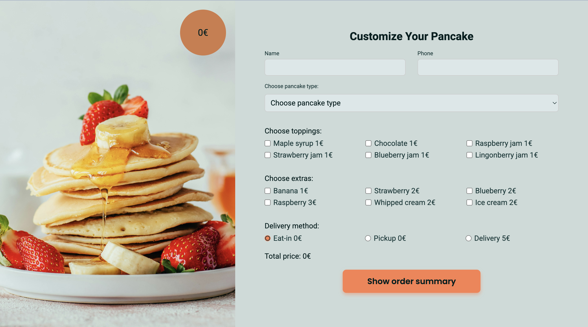
    </td>
  </tr>
</table>
<hr/>

<table>
  <tr>
    <td width="50%" valign="top">
      <h3>🥞 Pancake Order Customizer & Kitchen View</h3>
      <p>
        <a href="https://mashalink.github.io/web-portfolio/projects/pancakes/order/index.html">▶ Customer page</a>
        ·
        <a href="https://mashalink.github.io/web-portfolio/projects/pancakes/kitchen/index.html">▶ Kitchen page</a>
        ·
        <a href="https://github.com/mashalink/web-portfolio/tree/main/projects/pancakes">💻 GitHub</a>
      </p>
      <p>
        Interactive pancake ordering system built with <strong>HTML, CSS, and JavaScript (ES6 Modules)</strong>.  
        Customers can customize pancakes, see live price updates, and save orders.  
        Kitchen dashboard lets the chef view all orders and update their statuses (<code>waiting</code>, <code>ready</code>, <code>delivered</code>).
      </p>
      <p>
        📖 <a href="https://github.com/mashalink/web-portfolio/blob/main/projects/pancakes/README.md">Read more in Project README</a>
      </p>
    </td>
    <td width="50%" style="vertical-align: middle;">
      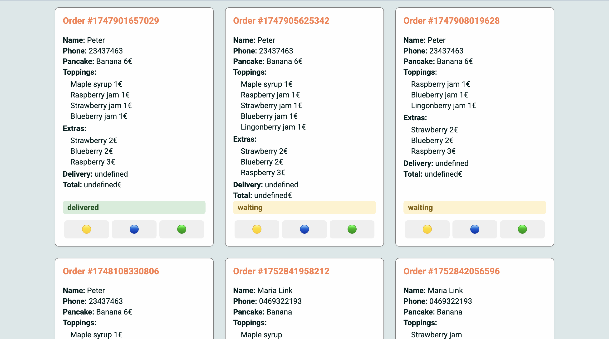
    </td>
  </tr>
</table>
<hr/>

<table>
  <tr>
    <td width="50%" valign="top">
      <h3>🏫 Course Landing Page – Full Stack Web Developer</h3>
      <p>
        <a href="https://mashalink.github.io/web-portfolio/projects/BC/index.html">▶ Open site</a>
        ·
        <a href="https://github.com/mashalink/web-portfolio/tree/main/projects/BC">💻 GitHub</a>
      </p>
      <p>
        Simple HTML & CSS landing page inspired by Business College Helsinki’s Full Stack program.  
        Clean design, hero section with call-to-action, about section with course topics, official branding, and responsive layout.
      </p>
      <p>
        📖 <a href="https://github.com/mashalink/web-portfolio/blob/main/projects/BC/README.md">Read more in Project README</a>
      </p>
    </td>
    <td width="50%" style="vertical-align: middle;">
      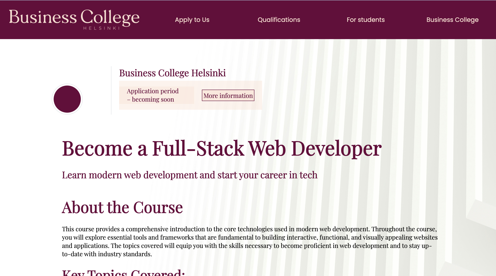
    </td>
  </tr>
</table>
<hr/>

<table>
  <tr>
    <td width="50%" valign="top">
      <h3>🎉 FlexFest – Flexbox Layout Practice</h3>
      <p>
        <a href="https://mashalink.github.io/web-portfolio/projects/Flex-projecti/flexfest.html">▶ Open site</a>
        ·
        <a href="https://github.com/mashalink/web-portfolio/tree/main/projects/Flex-projecti">💻 GitHub</a>
      </p>
      <p>
        Layout practice project using <strong>CSS Flexbox</strong> and Grid.  
        Features a festival-style landing page with navigation, hero, daily program, tickets, location map, image gallery, and footer.
      </p>
      <p>
        📖 <a href="https://github.com/mashalink/web-portfolio/blob/main/projects/Flex-projecti/README.md">Read more in Project README</a>
      </p>
    </td>
    <td width="50%" style="vertical-align: middle;">
      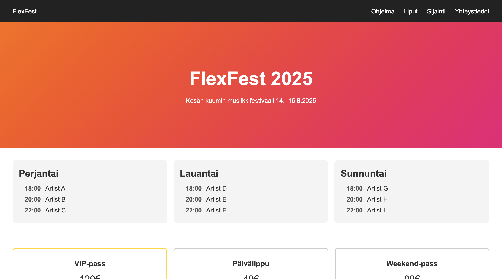
    </td>
  </tr>
</table>
<hr/>

<table>
  <tr>
    <td width="50%" valign="top">
      <h3>🎭 Two Truths and a Lie – Browser Game</h3>
      <p>
        <a href="https://mashalink.github.io/web-portfolio/projects/Icebreak/index.html">▶ Open site</a>
        ·
        <a href="https://github.com/mashalink/web-portfolio/tree/main/projects/Icebreak">💻 GitHub</a>
      </p>
      <p>
        A simple and fun party game built with <strong>HTML, CSS, and JavaScript</strong>.  
        Three players enter names and 3 statements (2 truths + 1 lie), then take turns guessing the lie with instant feedback and scoring.
      </p>
      <p>
        📖 <a href="https://github.com/mashalink/web-portfolio/blob/main/projects/Icebreak/README.md">Read more in Project README</a>
      </p>
    </td>
    <td width="50%" style="vertical-align: middle;">
      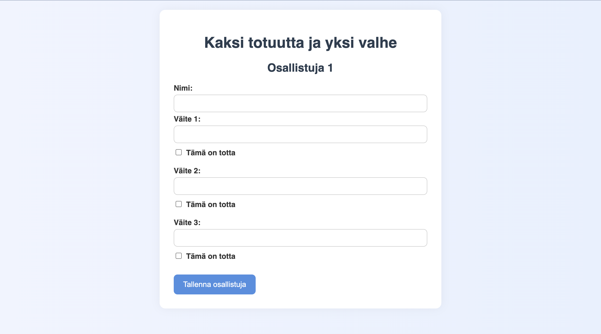
    </td>
  </tr>
</table>
<hr/>

<table>
  <tr>
    <td width="50%" valign="top">
      <h3>📰 Newsletter Sign-Up Form</h3>
      <p>
        <a href="https://mashalink.github.io/web-portfolio/projects/Lomake/index.html">▶ Open site</a>
        ·
        <a href="https://github.com/mashalink/web-portfolio/tree/main/projects/Lomake">💻 GitHub</a>
      </p>
      <p>
        Responsive newsletter-style form with <strong>client-side validation</strong>.  
        Features include password rules, email format check, confirm match, error messages with ARIA, success toast, and smooth responsive design.
      </p>
      <p>
        📖 <a href="https://github.com/mashalink/web-portfolio/blob/main/projects/Lomake/README.md">Read more in Project README</a>
      </p>
    </td>
    <td width="50%" style="vertical-align: middle;">
      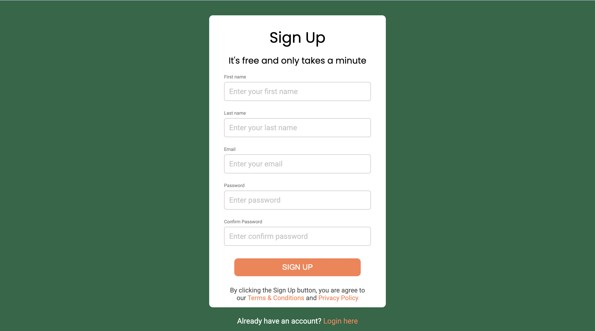
    </td>
  </tr>
</table>
<hr/>

<table>
  <tr>
    <td width="50%" valign="top">
      <h3>🔮 Magic 8-Ball – Web Simulator</h3>
      <p>
        <a href="https://mashalink.github.io/web-portfolio/projects/Magic_Ball/index.html">▶ Open site</a>
        ·
        <a href="https://github.com/mashalink/web-portfolio/tree/main/projects/Magic_Ball">💻 GitHub</a>
      </p>
      <p>
        Playful and animated <strong>Magic 8-Ball</strong> app built with HTML, CSS, and JavaScript.  
        Ask a yes/no question, shake the ball, and get one of 20 random answers with glowing effects and smooth animations.
      </p>
      <p>
        📖 <a href="https://github.com/mashalink/web-portfolio/blob/main/projects/Magic_Ball/README.md">Read more in Project README</a>
      </p>
    </td>
    <td width="50%" style="vertical-align: middle;">
      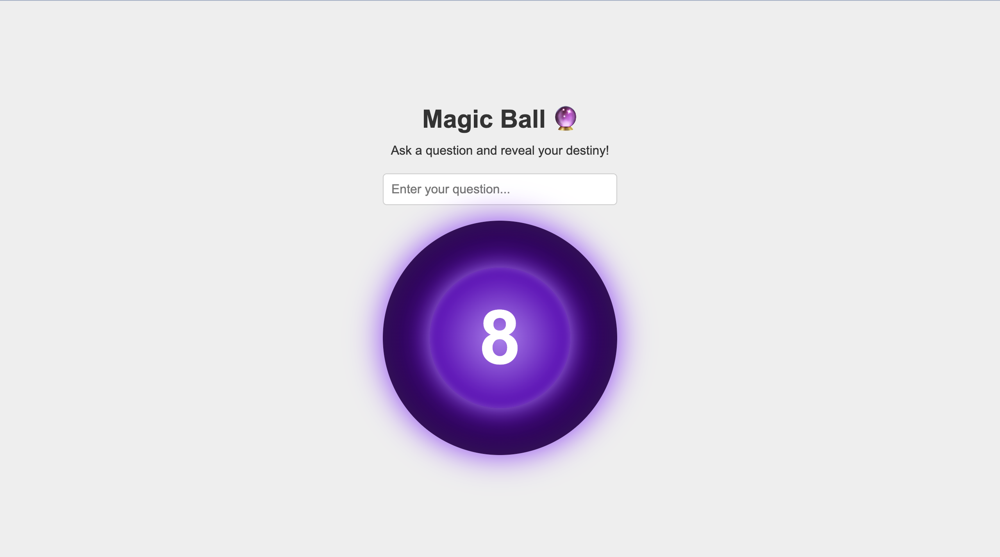
    </td>
  </tr>
</table>
<hr/>

<table>
  <tr>
    <td width="50%" valign="top">
      <h3>📦 Order Summary Component</h3>
      <p>
        <a href="https://mashalink.github.io/web-portfolio/projects/Order-Summary/index.html">▶ Open site</a>
        ·
        <a href="https://github.com/mashalink/web-portfolio/tree/main/projects/Order-Summary">💻 GitHub</a>
      </p>
      <p>
        Solution to the <strong>Frontend Mentor challenge</strong> "Order Summary Component".  
        Responsive order card built with HTML and CSS, focusing on Flexbox layout, typography, and background styling.
      </p>
      <p>
        📖 <a href="https://github.com/mashalink/web-portfolio/blob/main/projects/Order-Summary/README.md">Read more in Project README</a>
      </p>
    </td>
    <td width="50%" style="vertical-align: middle;">
      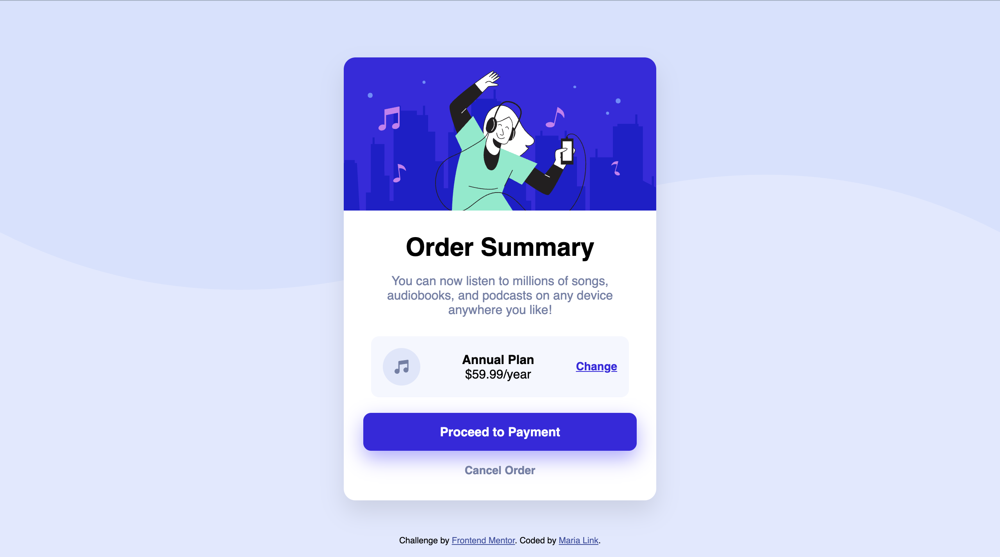
    </td>
  </tr>
</table>
<hr/>

<table>
  <tr>
    <td width="50%" valign="top">
      <h3>📖 Recipe Page</h3>
      <p>
        <a href="https://mashalink.github.io/web-portfolio/projects/Recipe-Page/index.html">▶ Open site</a>
        ·
        <a href="https://github.com/mashalink/web-portfolio/tree/main/projects/Recipe-Page">💻 GitHub</a>
      </p>
      <p>
        Solution to the <strong>Frontend Mentor challenge</strong> "Recipe Page".  
        Responsive page designed with semantic HTML, CSS custom properties, and Google Fonts <em>Young Serif</em> & <em>Outfit</em>.  
        Includes recipe sections, styled lists, and a modern, accessible layout.
      </p>
      <p>
        📖 <a href="https://github.com/mashalink/web-portfolio/blob/main/projects/Recipe-Page/README.md">Read more in Project README</a>
      </p>
    </td>
    <td width="50%" style="vertical-align: middle;">
      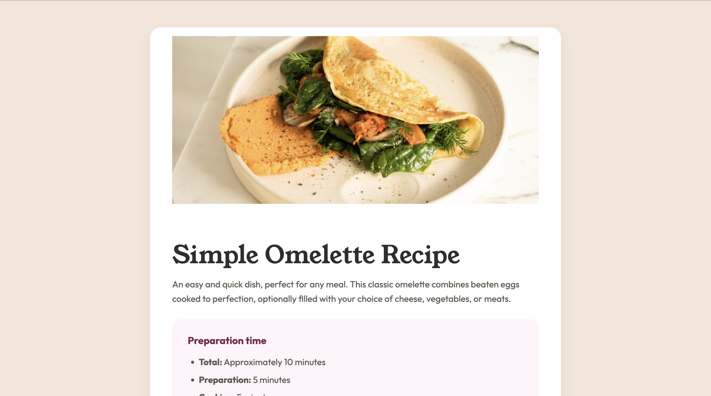
    </td>
  </tr>
</table>
<hr/>

<table>
  <tr>
    <td width="50%" valign="top">
      <h3>🏦 ATM Simulator – Web App</h3>
      <p>
        <a href="https://mashalink.github.io/web-portfolio/projects/Pankkiautomaatti/index.html">▶ Open site</a>
        ·
        <a href="https://github.com/mashalink/web-portfolio/tree/main/projects/Pankkiautomaatti">💻 GitHub</a>
      </p>
      <p>
        Browser-based <strong>ATM simulation</strong> built with HTML, CSS, and JavaScript.  
        Features PIN login (<code>2003</code>), balance check, deposits, withdrawals with validation, overdraft protection, and instant updates.
      </p>
      <p>
        📖 <a href="https://github.com/mashalink/web-portfolio/blob/main/projects/Pankkiautomaatti/README.md">Read more in Project README</a>
      </p>
    </td>
    <td width="50%" style="vertical-align: middle;">
      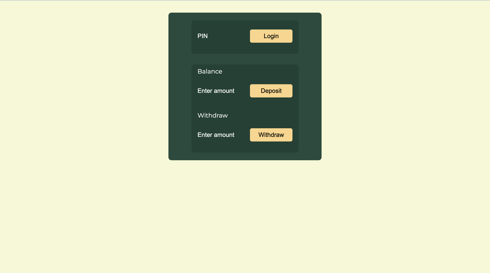
    </td>
  </tr>
</table>
<hr/>

<table>
  <tr>
    <td width="50%" valign="top">
      <h3>🐻🦊🦅 Pikku Eläintarha – Mini Zoo App</h3>
      <p>
        <a href="https://mashalink.github.io/web-portfolio/projects/Pikku_elantarha/index.html">▶ Open site</a>
        ·
        <a href="https://github.com/mashalink/web-portfolio/tree/main/projects/Pikku_elantarha">💻 GitHub</a>
      </p>
      <p>
        Interactive <strong>animal listing and management app</strong> built with HTML, CSS, and JavaScript.  
        Features filtering, live search, adding/removing animals, creating new types, sorting, and card-style UI.
      </p>
      <p>
        📖 <a href="https://github.com/mashalink/web-portfolio/blob/main/projects/Pikku_elantarha/README.md">Read more in Project README</a>
      </p>
    </td>
    <td width="50%" style="vertical-align: middle;">
      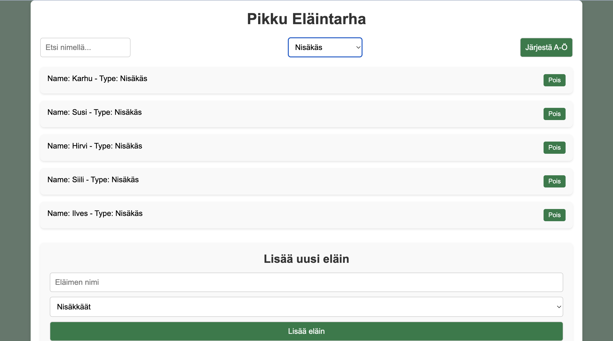
    </td>
  </tr>
</table>
<hr/>

👩‍💻 Author: **Maria Link**
