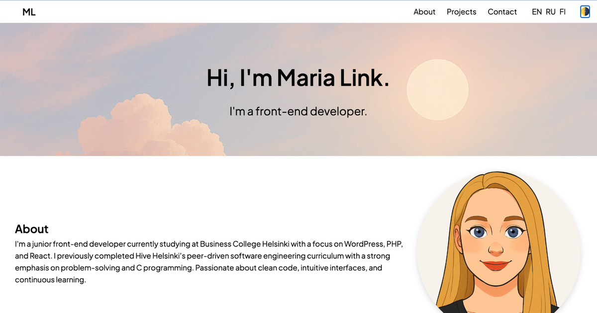

# Maria Link — Web Portfolio

**Live:** https://mashalink.github.io/web-portfolio/  
**Repo:** https://github.com/mashalink/web-portfolio

A personal portfolio site built with plain **HTML, CSS, and JavaScript**.
It is responsive, available in **English, Russian, and Finnish**, supports **light and dark themes**, and highlights current internship work plus selected public projects.



## Highlights

- Short hiring-oriented intro and downloadable CV in the hero
- Responsive layout for desktop and mobile
- Current work card for the private EllarionTales internship project
- Two featured public projects with live demos, repo links, and preview screenshots
- Hero-style contact buttons in the footer for email, LinkedIn, and GitHub
- Light and dark theme with saved preference
- EN / RU / FI language switching
- Burger navigation and back-to-top button
- Basic accessibility support and social preview metadata

## Current Work

### [EllarionTales](https://github.com/mashalink/EllarionTales)

Private internship project for a LARP registration flow.

- **Site:** https://ellariontales.com/
- **Focus:** backend availability rules, character-group capacity, premium handling, transactional registration saves, and tests/CI
- **Tech:** Node.js, Express, PostgreSQL, Sequelize, Jest

## Featured Work on the Site

### [Bloglist](https://bloglist-dunc.onrender.com/)

Featured app from the FullStack Open coursework.

- **Repo:** https://github.com/mashalink/FullStack
- **Demo login:** `demo` / `demopass`
- **Focus:** React frontend with Node/Express API, persisted auth, post creation, likes, comments, delete-own-post flow, and test coverage
- **Tech:** React, Redux, React Router, Node.js, Express, MongoDB

### [HR App](https://hrapp-1-y52h.onrender.com/)

Employee-management app with a React/Vite frontend and a Render-hosted JSON Server backend.

- **Repo:** https://github.com/mashalink/hrApp
- **Focus:** browsing employees, adding and editing records, and probation/anniversary reminders in a simple admin UI
- **Tech:** React, Vite, React Router, Axios, Material UI, JSON Server

## Project Structure

```text
web-portfolio/
├─ css/
│  ├─ about.css
│  ├─ burger.css
│  ├─ cards.css
│  ├─ contacts.css
│  ├─ hero.css
│  ├─ style.css
│  └─ to-top.css
├─ img/
│  ├─ icons/
│  ├─ hero-bg-day.png
│  ├─ hero-bg-night.png
│  ├─ light.png
│  ├─ dark.png
│  ├─ bloglist-preview.png
│  ├─ hrapp-preview.png
│  └─ preview.png
├─ assets/
│  └─ cv/
│     └─ Masha_Link_CV_2025.pdf
├─ js/
│  ├─ burger.js
│  ├─ card.js
│  ├─ i18n.js
│  ├─ main.js
│  ├─ theme.js
│  └─ to-top.js
├─ index.html
├─ LICENSE
└─ README.md
```

## Main Technical Notes

- **Translations:** stored in `js/i18n.js` and `js/card.js`
- **Theme handling:** implemented in `js/theme.js` and persisted in `localStorage`
- **Project cards:** rendered from localized data in `js/card.js` with preview screenshots from `img/`
- **Contact section:** hero-style email, LinkedIn, and GitHub buttons in the footer, with the availability line above them

## Run Locally

No build tools are required.

1. Clone the repository:

   ```bash
   git clone https://github.com/mashalink/web-portfolio.git
   cd web-portfolio
   ```

2. Open `index.html` in a browser, or use **VS Code Live Server** for local development.

## Deployment

This site is deployed through **GitHub Pages** from the repository root.

## Accessibility

- Semantic HTML structure
- Focus-visible styles
- Screen-reader-only helper text for external links
- Language switching and theme switching without reload

## License

This project is licensed under the **MIT License**. See [LICENSE](LICENSE).
