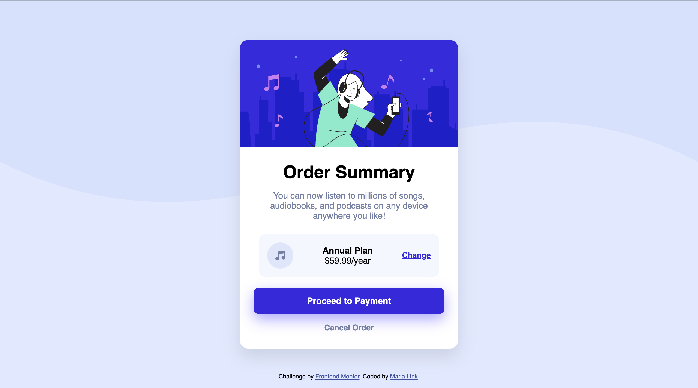

# Order Summary Component

## 📋 Description

This is my solution to the [Order Summary Component](https://www.frontendmentor.io/challenges/order-summary-component-QlPmajDUj) challenge on Frontend Mentor.  
The goal was to build a responsive order summary card based on the given design, practicing Flexbox, typography, and background styling.

## 🚀 Technologies

- **HTML5** – semantic markup
- **CSS3** – styling, Flexbox, Google Fonts
- **Responsive Design** – adapts to various screen sizes

## 📂 Project Structure

├── index.html # Main HTML page

├── style.css # Styles

└── images/ # Images and icons

## 🔗 Live Demo

[View Demo](https://your-live-demo-link.com) <!-- Replace with your GitHub Pages link -->

## 📝 Challenge Source

- [Frontend Mentor](https://www.frontendmentor.io?ref=challenge)

---

💻 Built by **Maria Link**
