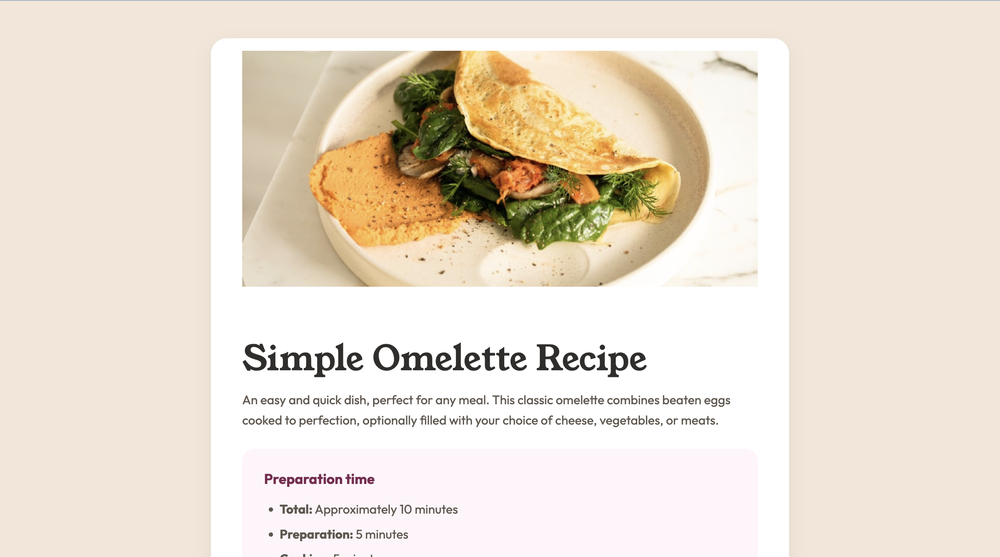

s# Recipe Page

## 📋 Description

This is my solution to the [Recipe Page](https://www.frontendmentor.io/challenges/recipe-page-KiTsR8QQKm) challenge on Frontend Mentor.  
The goal was to build a responsive recipe page based on the given design, following the specified color palette, typography, and layout.

## 🚀 Technologies

- **HTML5** – semantic markup
- **CSS3** – custom properties (CSS variables), Flexbox, responsive design
- **Google Fonts** – _Young Serif_ for headings, _Outfit_ for body text

## 🎨 Design Specs

**Colors**

- White: `hsl(0, 0%, 100%)`
- Stone 100: `hsl(30, 54%, 90%)`
- Stone 150: `hsl(30, 18%, 87%)`
- Stone 600: `hsl(30, 10%, 34%)`
- Stone 900: `hsl(24, 5%, 18%)`
- Brown 800: `hsl(14, 45%, 36%)`
- Rose 800: `hsl(332, 51%, 32%)`
- Rose 50: `hsl(330, 100%, 98%)`

**Typography**

- Body font size: `16px`
- Font families:
  - **Young Serif** (400) – headings
  - **Outfit** (400, 600, 700) – body text

## 📂 Project Structure

├── index.html # Main HTML page

├── style.css # Styles

└── images/ # Images and icons

## 🔗 Live Demo

[View Demo](https://your-live-demo-link.com) <!-- Replace with your GitHub Pages link -->

## 📝 Challenge Source

- [Frontend Mentor](https://www.frontendmentor.io?ref=challenge)

---

💻 Built by **Maria Link**
