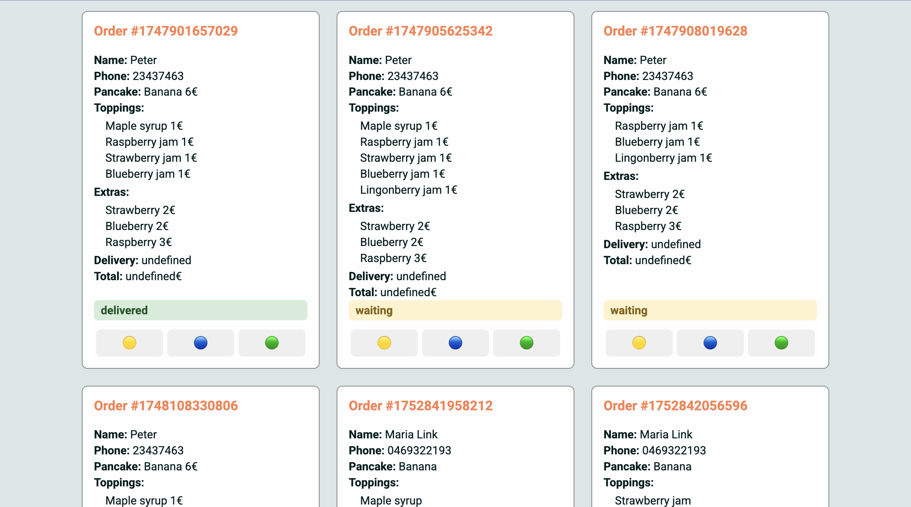

# 🥞 Pancake Order Customizer & Order Management

## 📋 Description

An interactive web application for creating, customizing, and managing pancake orders.

**User features:**

- Choose pancake type
- Add toppings and extra ingredients
- Select a delivery method
- See the total price update instantly
- View an order summary in a modal
- Save the order to `localStorage`

**Chef features (Order Management page):**

- View all saved orders
- Update order status (`waiting`, `ready`, `delivered`)
- Visual color-coded statuses

---

## 🚀 Technologies

- **HTML5** – semantic structure for forms and pages
- **CSS3** – custom styling, animations, responsive design
- **JavaScript (ES6 Modules)** – state management, dynamic UI updates
- **LocalStorage API** – persistent storage of orders
- **Google Fonts** – modern typography

---

## 📂 Project Structure

├── index.html

├── css/

│ ├── base.css

│ ├── variables.css

│ ├── buttoms.css

│ ├── components.css

│ ├── layout.css

│ ├── status.css

└── js/

└── main.js

---

## 🛠 How to Run

### Orders (Chef) page

1. Open `index.html` in a browser.
2. View all orders saved from the customer page.
3. Use the buttons to update status:
   - 🟡 Waiting
   - 🔵 Ready
   - 🟢 Delivered

---

## 📅 Future Improvements

- Search and filter orders by name or ID
- Delete delivered orders
- Password protection for the chef page
- Improved UI/UX

---

💻 Built by **Maria Link**
